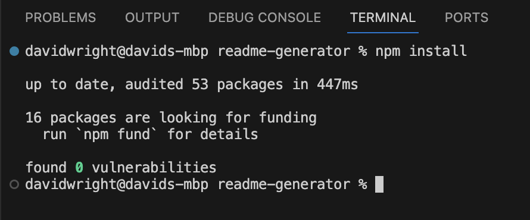
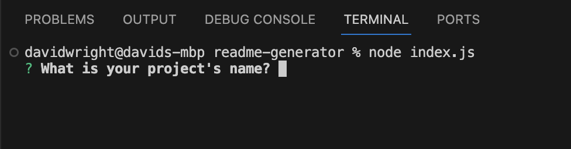
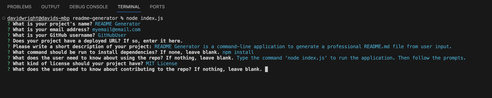
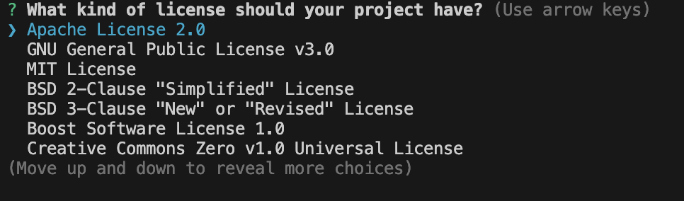
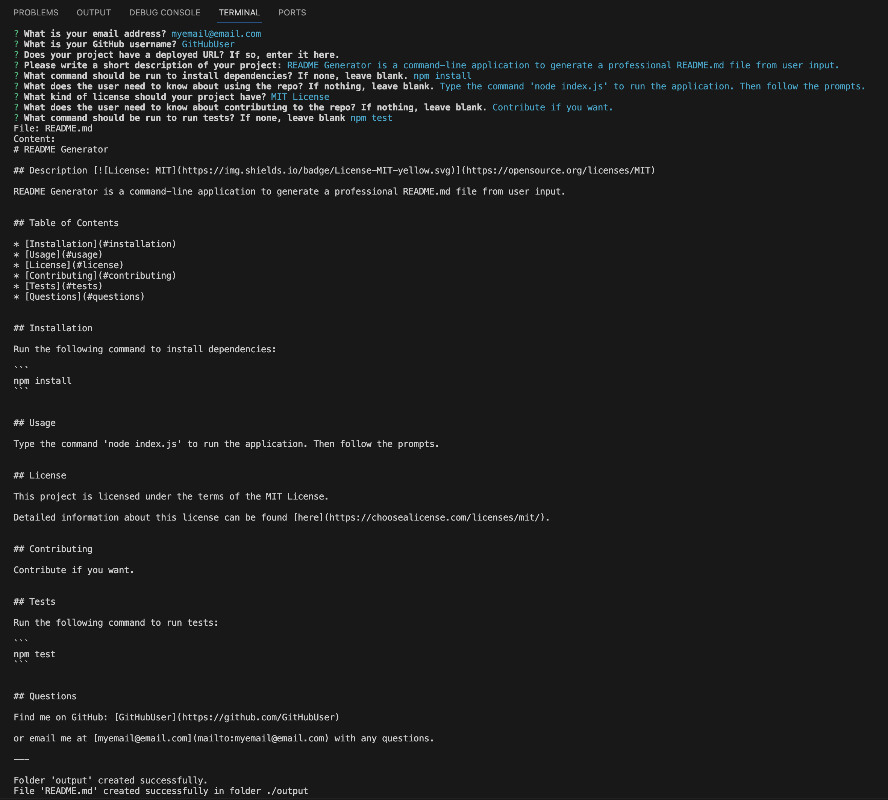
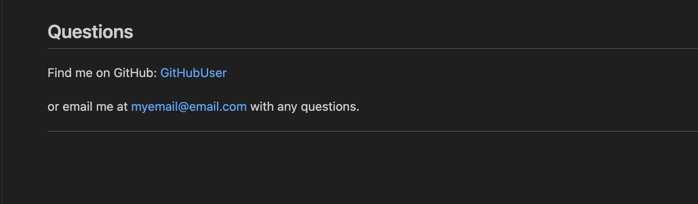

# README Generator

## Description 

For this project I created a command-line application to dynamically generate a professional README.md file. The file is populated from a user's input using the Inquirer package.

This project gave me the opportunity to learn more about Inquirer and various input options, as well as Node fs which I used to create the output file. I also worked on linking javascript modules with multiple exports. I added some additional functionality to allow the user to optionally not include various sections, while others (like Project Name, email address, and github username) required an input for the application to proceed. Finally, the README text content was put together with multiple string literals.

Combining all of these components resulted in a successful application and a great learning experience.


## Installation

Copy all files and folders into the desired installation folder.

To install dependencies, in this case Inquirer and dayjs, use the command line to navigate to the installation folder and enter the following command:

```npm install```



## Usage 

To run the application, navigate to the installation folder using Terminal (Mac OS), Git Bash (PC) or equivalent command-line interface, and enter the following command:

```node index.js```



All of the prompts are shown below:



The user selects a license by moving up and down with the arrow keys and pressing Enter. "None" is also an option. License selection is shown below:



The terminal output is shown below:



A markdown preview of the generated file is shown below:





## Credits

This application uses [Inquirer v8.2.4](https://www.npmjs.com/package/inquirer/v/8.2.4) and [fs](https://nodejs.org/api/fs.html#file-system).

Badges were provided by [lukas-h](https://gist.github.com/lukas-h/2a5d00690736b4c3a7ba) and made with [Shields.io](http://shields.io/).


## License

Please refer to the LICENSE in the repo.


---
